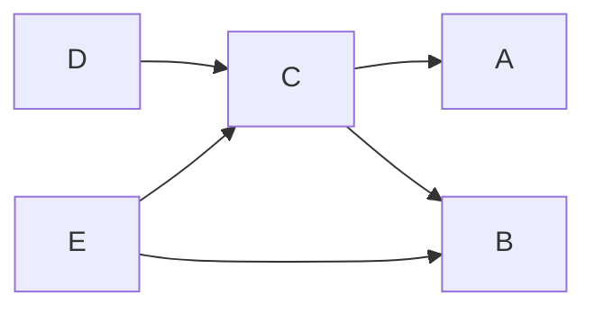

# dagio

Work in progress, use at your own discretion.

## Docs

Just two functions: 

- `define` is used to build DAGs. It makes it impossible to introduce cycles by design as you can only reference nodes that have already been defined.
- `traverse` lets you traverse a DAG while generating data for each node.

## Example



```typescript
const dag = factory()
  .add('a')
  .add('b')
  .add('c', 'a', 'b')
  .add('d', 'c')
  .add('e', 'b', 'c')
  .commit();

/*
const dag: {
    readonly a: [];
    readonly b: [];
    readonly c: ["a", "b"];
    readonly d: ["c"];
    readonly e: ["b", "c"];
}
*/

const t = traverse(dag)
  .set('a', () => 42)
  .set('b', () => 33)
  .set('c', ({ a, b }) => a() + b())
  .set('d', ({ c }) => c() * 2)
  .set('e', ({ b, c }) => String(b() / c()))
  .commit();

/*
const t: {
    a: () => number;
    b: () => number;
    c: () => number;
    d: () => number;
    e: () => string;
}
*/

console.log(t.d() % 2 === 0); // true
console.log(t.e() === '0.44'); // true

```

## Roadmap

- `traverse > setDefault`: easily set traverse fn that are shared by a lot of nodes
- `traverse(dag, { middleware })`: eg. add middleware to memoize, or to inject configs
  - pre middleware -> change what the functions receives (eg. preload deps)
  - post middleware -> change the functions (eg. moize)
